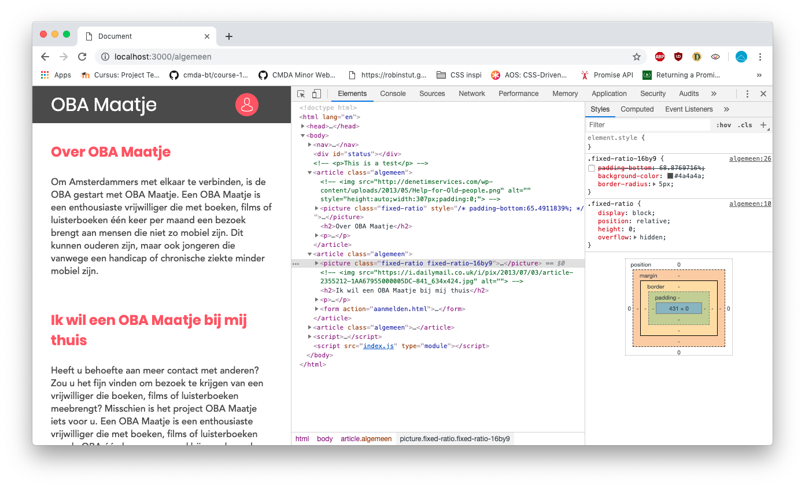

# Performance Matters @cmda-minor-web · 2018-2019

## How to install

```
git clone https://github.com/RobinStut/performance-matters-1819

cd performance-matters-1819

nodemon index.js localhost 3000

```

---

## Performance vergelijking met Audits

client-side performance check


server-side performance check


## Performance vergelijking van network

client-side performance check


server-side performance check


## WebPageTest check op de client


# Verbetering van de performance

## Lazyloading

Wanneer een pagina geladen wordt haalt de browser alle afbeeldingen op. Het kan hierdoor even duren voordat je pagina bruikbaar is. Met Lazyloading zorg je er voor dat alleen de afbeeldingen die in de viewport zichtbaar zijn worden opgehaald. Het voordeel hiervan is dat de pagina sneller klaar is met laden, omdat niet alle afbeeldingen opgehaald hoeven te worden. Zodra er gescrolled wordt op de pagina en een afbeelding die niet bij de First Load is ingeladen tevoorschijn komt, wordt deze alsnog opgehaald. De benaming Lazy is vrij negatief, maar waar het op neer komt is dat de afbeelding alleen wordt ingeladen als het echt nodig is. Minimale inspanning voor het laden, _maximale_ snelheid voor de gebruiker

### Voorbeeld zonder Lazyloading


Alle afbeeldingen worden ingeladen. 291kb ingeladen

### Voorbeeld met Lazyloading


Alle afbeeldingen worden ingeladen. 231kb ingeladen

In dit voorbeeld wordt er 60kb bespaard aan laadtijd. Wanneer er meer afbeeldingen zijn die opgehaald moeten worden, stijgt dit aantal.

## Image Reflow

Als een pagina aan het laden is en de afbeeldingen nog niet ingeladen zijn, kan het voorkomen dat de pagina al zichtbaar is maar de afbeeldingen er nog niet zijn. In dat geval is het mogelijk dat de ruimtes tussen de content en de afbeeldingen verspringen zodra er wel een afbeelding klaar is met inladen. Dit kan er voor zorgen dat een gebruiker het overzicht verliest waar er eerst gekeken werd, en hiermee een vervelende ervaring krijgen. Om dit te voorkomen is het mogelijk om een vaste breedte te geven aan een container van de afbeelding.

```
Stappenplan:

1. Geef de container een height van 0
2. Bereken de ratio van de getoonde afbeelding. vb: 100 : (breedte van afbeelding in px) = (uitkomst). (Uitkomst) x (hoogte van afbeelding in px) = RATIO
3. Geef de container een padding-bottom van het berekende RATIO.
```

Op deze manier heeft de container de ruimte al gereserveerd voor de afbeelding en verspringt de pagina niet zodra de afbeelding is ingeladen.

### Voorbeeld van pagina met reflow



afbeeldingen zijn nog niet geladen


Er is reflow doordat de eerste afbeelding is ingeladen

### Voorbeeld van pagina zonder reflow


Er is ruimte gereserveerd voor de afbeelding


De afbeelding is ingeladen en veroorzaakt geen reflow

### Voorbeeld van nette oplossing zonder reflow

Een gebruiker heeft geen feedback zodra een ruimte is gereserveerd maar de ruimte gewoon wit is. Door een background toe te voegen is het duidelijker dat er iets is/gaat komen. Zodra de afbeelding dan is ingeladen verdwijnt de achtergrond.


De afbeelding heeft een background als opvulling


De afbeelding is ingeladen en de achtergrond is overschreven
